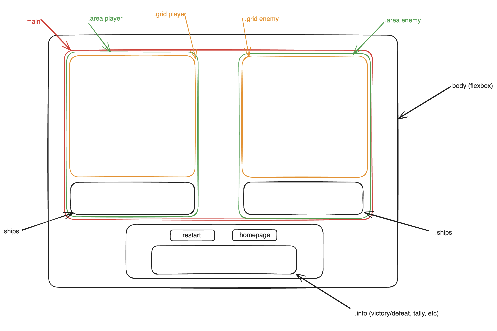

# GA-SEI Project 1 Space-battle

[battleship]: urltocome
[githubrepo]: urltocome

## Timeframe
7 days, worked independently

## Technologies used
* JavaScript (ES6)/ JS audio
* HTML5
* CSS/Flexbox
* GitHub

## [Battleship][battleship] - JavaScript application

<!-- links where to find -->

## Project Description
This game was produced as part of the General Assembly Software Engineering Immersive Bootcamp, as the first project in the bootcamp using technologies taught in the bootcamp until this point. No Frameworks/Backend at all.

The game I chose to recreate was Battleship, as I believed it to be a proper challenge, but not unattainable in the timeframe available. I also chose to change its theme to a Sci-fi space-war setting, because I liked the idea.

## Project briefing
The brief we were handed specified the following:

Create a browser game using vanilla JavaScript, HTML, and CSS. The game must:

Render a game in the browser
Include win/loss logic and render win/loss messages in HTML
Include separate HTML, CSS, and JavaScript files
Have properly indented HTML, CSS, and JavaScript with consistent vertical whitespace
Have no remaining unused or commented out code
Have sensible function and variable names
Be coded in a consistent manner
Be deployed online using GitHub pages
In addition, before starting work on the game, a wireframe and basic pseudocode for the gameplay had to be presented and approved.

## Project Planning
I provided a basic wireframe of the playing field:



Along with pseudocode for the project:
```
//* Objects
/*
class Ship{
  type: string,
  cells: number,
  horizontal: boolean (if not horizontal, it is vertical),
  positions: [] (to be declared when placed),
  damagedCells: number,
  destroyed: boolean,
  
  constructor(type) {
    this.type = type
    depending on type automatically define this.cells
    default horizontal: true
  }
}
*/

//* Variables
/* 
const playerShips {Carrier (occupies 5 spaces), Battleship (4), Cruiser (3), Submarine (3), and Destroyer (2)}
const enemyShips {Carrier (occupies 5 spaces), Battleship (4), Cruiser (3), Submarine (3), and Destroyer (2)}
let turn boolean
placementFinished boolean
*/

//* Elements
/* 
const playerGrid NodeList
const enemyGrid NodeList
*/

//* Executions
/*
shipPlacement()(recursive) when player positions ships, careful of ship exiting designated grid
enemyPlacement() (find positions of already placed ships to avoid collision and ships touching)
battle()(recursive) when enemy turn starts 0.5 seconds timeout to give some breathing room
enemyShot() if ship has been hit, find adjacent cells if not, randomise shot
shot() find out if hit or miss, and pass corresponding cell to the appropriate function
hit(cell) change data of ship object, play explosion sound and if possible dispay fire on top of ship in the cell. If ship is destroyed shipDestroyed()
miss(cell) play spacey pewpew sound, color cell a non aggressive color and
shipDestroyed()
gameEnd()
*/

//* Events
/*
onkeyup to rotate the ships when placing and placementFinished === false
click on all cells in enemyGrid to be activated when turn boolean favors player
*/

//* Page load``
```

## Coding Process
At fist, I dedicated a whole day to create the HTML and nail the styling:


After that I started coding but I soon found out that even if my planning was mostly sound, a lot of things had escaped my foresight, and others could do with a little streamlining such as:

```javascript
class TeamShips{
  constructor(Ship) {
    this.shipList[0] = Ship
  }
  addShip(Ship) {
    this.shipList.length <= 5 ? this.shipList.push(Ship) : false
  }
}
```
that became:
```javascript
let playerShips = []
let enemyShips = []
```

and as soon as I did that I started coding the basic Event Listeners with which all player input/feedback is built upon:
```javascript
shipSelect.forEach(value => {
  value.addEventListener('click', (e) => {
    const type = e.target.classList[1]
    shipNew = new Ship(type)
  })
})

// player places ships
playerGrid.forEach((value, index) => {
  value.addEventListener('click', (e) => {
    if (!shipNew) {
      const recover = display.innerHTML
      display.innerHTML = '<p>-- YOU MUST CHOOSE A SHIP --</p>'
      setTimeout(() => {
        display.innerHTML = recover
      }, 2000)
      return
    } else {
      console.log(index)
      playerPlacement(index)
    }
  })
})

// Mouse on hover
playerGrid.forEach((value, index) => {
  value.addEventListener('mouseover', () => {
    //clearing previous cells
    playerGrid.forEach(cell => {
      cell.classList.remove('hover')
    })
    // finding cells to 'hover'
    if (shipNew) {
      if (shipNew.horizontal === true) {
        const hoverCells = []
        for (let i = 0; i < shipNew.cells; i++) {
          if (i === 0 && index % 10 === 0) {
            hoverCells.push(index)
            continue
          }
          if ((index + i) % 10 !== 0) {
            hoverCells.push(index + i)
          } else {
            return
          }
        }
        hoverCells.forEach((val) => {
          playerGrid[val].classList.add('hover')
        })
      }
    }
  })
})

```
from the on I had to code the player ship placement and the computers, avoiding collisions and allowing both horizontal and vertical placement, and in the case of the player, allowing to reposition any ship.

From that point on, I started working on the second phase of the game, the "combat". I created a function to randomise computer shots, to get to work and debug the game until it finally worked and eventually reprogrammed it so shots aren't completely random. In the meantime I had a very big issue because shot() handled both player and computer shots:

```javascript
function shot(index){ 
  if (continueGame) {
    let aim = painComingTo()
    if (aim[2].includes(index) && !aim[3].includes(index)) {
      hit(index)
      if (!turn) shotTaken = !shotTaken
    } else if (aim[3].includes(index)) {
      if (!turn) {
        shot(randomIndex())
        console.log(shotTaken)
      } else {
        control++
        console.log(control)
        announcement('<p>-- ENGAGE NEW TARGET --</p>', 1000)
        return false
      }
    } else if (!aim[2].includes(index) && !aim[3].includes(index)){
      miss(index)
    }
    aim[3].push(index)
    turn = !turn
    if (!turn && !shotTaken) {
      setTimeout(() => shot(randomIndex()), 250)
    }
  }
  shotTaken = false
}
```

The recursiveness caused the computer, in some machines, to take multiple shots; sometimes to its own grid. In later versions shot() would be independent from enemyShot():

```javascript
function shot(index){
  if (continueGame) {
    const aim = painComingTo()
    if (aim[2].includes(index) && !aim[3].includes(index)) {
      hit(index)
    } else if (aim[3].includes(index)) {
      announcement('<p>-- ENGAGE NEW TARGET --</p>', 1000)
      return
    } else if (!aim[2].includes(index) && !aim[3].includes(index)){
      miss(index)
    }
    aim[3].push(index)
    turn = !turn
    setTimeout(() => enemyShot(), 750)
  }
}

function enemyShot() {
  //to keep computer from running wild
  if (continueGame) {
    const aim = painComingTo()

    if (targeting.length < 3) {
      targeting.push(Math.random() > 0.5 ? 0 : 1)
    }
    let index
    if (hunted.length !== 0) {
      const options = huntRandom()
      index = options[Math.floor(Math.random() * options.length)]
    } else {
      index = checkerboardIndex(aim)
    }
    if (aim[2].includes(index) && !aim[3].includes(index)) {
      hit(index)
      hunt(index, aim)
    } else if (aim[3].includes(index)) {
      enemyShot()
    } else {
      miss(index)
    }
    aim[3].push(index)
    turn = true
  }
}
```
Of course, in the meantime, I implemented many details, such as audio feedback for shots and misses, explosion gifs for hit cells, and messaging on the bottom display.

I eventually created an algorithm for hunting a ship that has been hit already and acheckerboard pattern to make the computers shooting algorithm a bit more 'purposeful' when not engaged in an active hunt (this last part was for some weird reason THE single hardest thing to conceptualise for me)

```javascript
let targeting = [[], []]

for (let i = 0; i < 10; i++) {
  for (let f = i * 10; f < (i + 1) * 10; f++) {
    if ((i % 2 === 0 && f % 2 === 0) || (i % 2 !== 0 && f % 2 !== 0)) {
      targeting[0].push(f)
    } else {
      targeting[1].push(f)
    }
  }
}
// and also:
function checkerboardIndex(aim) {
  const index = Math.floor(Math.random() * 50)
  return !aim[3].includes(targeting[targeting[2]][index]) ? targeting[targeting[2]][index] : checkerboardIndex(aim)
}
//targeting[2] gets randomised the very first time enemyShot is accessed, aim is all the targeting data necessary for the turn
```

the hunting algorithm is also something I am proud of, but since I was able to break it down into smaller parts to solve individually, it wasn't as much of a headache:

```javascript
function huntRandom(){
  let options
  const killTarget = hunted[0].positions
  if (killTarget.length === 1) {
    options = [killTarget[0] + 1, killTarget[0] - 1, killTarget[0] + 10, killTarget[0] - 10]
    for (let i = options.length - 1; i >= 0; i--) {
      if (i < 0 || i > 99 || shotPlayerCells.includes(i)) {
        options.splice(i, 1)
      }
    }
    if (killTarget[0] % 10 === 0) options.splice(1, 1)
    if (killTarget[0] % 10 === 9) options.splice(0, 1)
  } else if (hunted[0].horizontal === undefined) {
    
    if (killTarget[0] === killTarget[1] + 1 || killTarget[0] === killTarget[1] - 1) hunted[0].horizontal = true
    if (killTarget[0] === killTarget[1] + 10 || killTarget[0] === killTarget[1] - 10) hunted[0].horizontal = false
  }
  if (killTarget.length > 1){
    if (hunted[0].horizontal) {
      if (Math.max(...killTarget) % 10 !== 9 && !shotPlayerCells.includes(Math.max(...killTarget) + 1)) {
        options = [Math.max(...killTarget) + 1]
      } else {
        options = [Math.min(...killTarget) - 1]
      }
    } else {
      if (Math.max(...killTarget) + 10 < 100 && !shotPlayerCells.includes(Math.max(...killTarget) + 10)) {
        options = [Math.max(...killTarget) + 10]
      } else {
        options = [Math.min(...killTarget) - 10]
      }
    }
  }
  return options
}
```

## Wins and Challenges(TLDR)
To be completely honest, my wins here are the same as the challenges, more specifically beating those challenges. The AI targeting checkerboarding or the hunting algorithm are good examples of what I'm referring to. 

Special mention to the CSS as well, in which I investigated experimented with and implemented many new things I had never done or seen before, such as text perspective, text gradient "overlay", glow, glow animation...

Finding spaceship images that met my needs was a massive pain as well, I tried DALL-E 4 to create them but to no avail, that's why a keen eye can see "artistic discrepances" between them.

## Bugs
There have been a number of bugs in my code, most solved within the hour, there was however a very persistent and difficult to catch bug, which caused the computer to shoot many times and indiscriminately. When the code was tested in a computer other than mine, it didn't occurr, however, since I believed it to be because of the recursion necessary to house shot() and enemyShot() as one unique function, I separated them into two and the issue stopped, at a bit of a cost in DRYness

## Other considerations
Had I had another week to work on this project, I would've tried to refine the AI targeting further, taking into consideration the largest ship the enemy has remaining, and where could it hide. I would try to implement difficulty levels, from the completely randomised shooting to the previously explained refined targeting, and implement a good 2 player functionality.

Still, I am proud of what I have achieved here, but I wonder what could have been... Maybe one day...